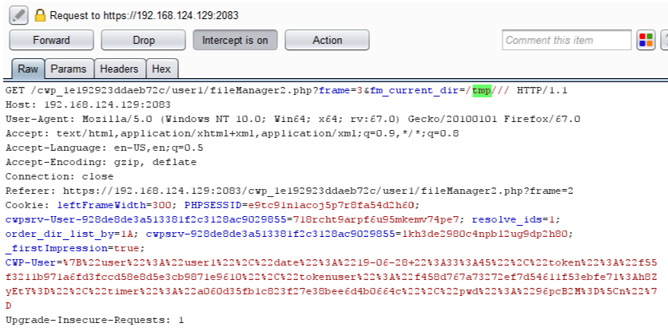
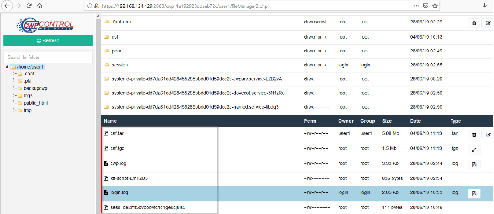
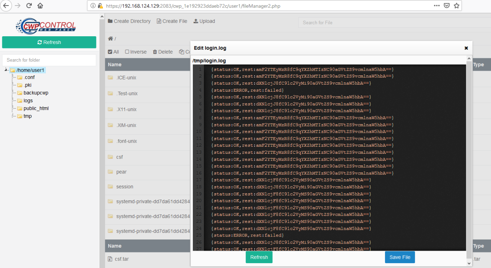

# Information
```
Exploit Title: CWP (CentOS Control Web Panel) User Enumeration
Date: 23 July 2019
Exploit Author: Pongtorn Angsuchotmetee, Nissana Sirijirakal, Narin Boonwasanarak
Vendor Homepage: https://control-webpanel.com/
Software Link: Not available, user panel only available for lastest version
Version: 0.9.8.836 to 0.9.8.840
Tested on: CentOS 7.6.1810 (Core)
CVE : CVE-2019-13385
```
# Description
```

An attacker who gains access as a low privilege user can check active users on the system by checking log file.
The access log is stored at /tmp directory with encoded content in base64 
```

#  Steps to Reproduce

1. Login as a low privilege user --> FileManager --> Click Directory

<kbd></kbd>

<br>

2. Intercept the request and modify parameter "fm_current_dir" value to tmp

<kbd></kbd>

<kbd></kbd>

<br>

3. We can access tmp path, login log is login.log file in base64 format

<kbd></kbd>

<kbd></kbd>

<br>

4. Copy login.log to local machine

<kbd></kbd>

<br>

5. Decode base64

<kbd></kbd>

<br>

#  Timeline

```
+++++++++++++++++++++++++++++++++
#  Timeline
+++++++++++++++++++++++++++++++++
2019-07-03: Discovered the bug
2019-07-03: Reported to vendor
2019-07-04: Vender accepted the vulnerability
2019-07-11: The vulnerability has been fixed
2019-07-23: Published
```
