# Information
```
Product             : CWP Control Web Panel
Vulnerability Name  : Cross Site Scripting
version             : 0.9.8.837
Fixed on            : 0.9.8.851
Test on             : CentOS 7.6.1810 (Core)
Reference           : http://centos-webpanel.com/
                    : https://control-webpanel.com/changelog
CVE-Number          : CVE-2019-13476
```
<br>

# Description

CVE-2019-13476 (XSS) + CVE-2019-13477 (CSRF) Can change password no need to know current password 

<br>

# Reproduce

1. login as normal user

<kbd>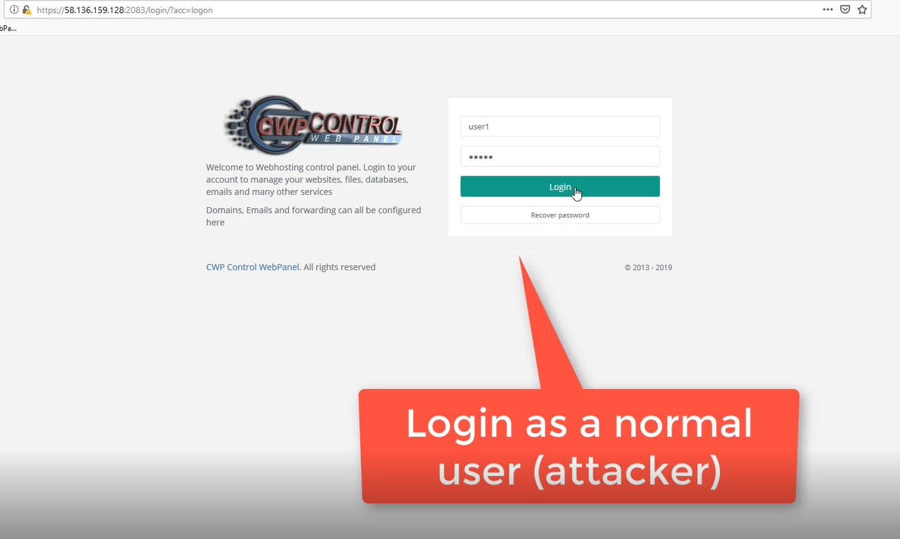</kbd>

<br>

2. Click at Email Accounts under the Email Accounts and click it again like image below

<kbd>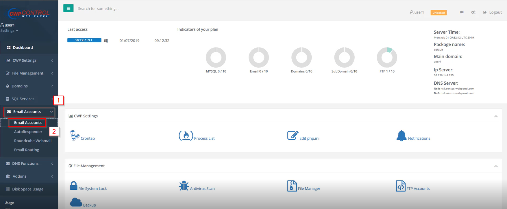</kbd>

<br>

3. Click add "New MailBox" 

<kbd>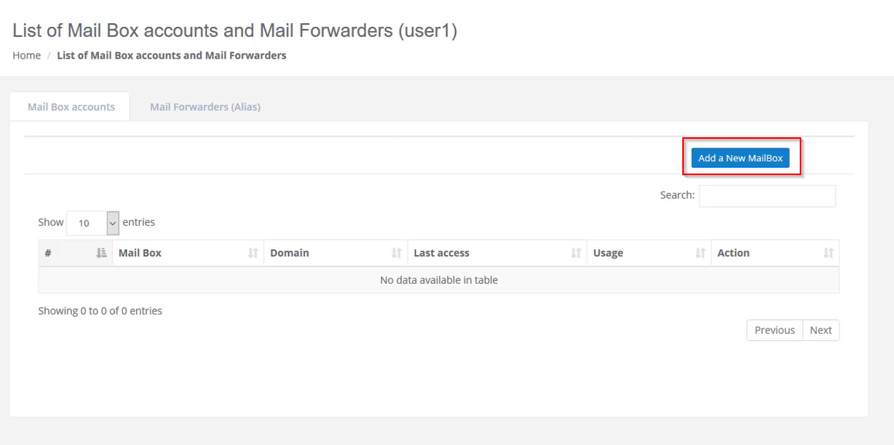</kbd>

<br>

4. add "New mail" and intercept request (use Burp suite for intercept request)

<kbd>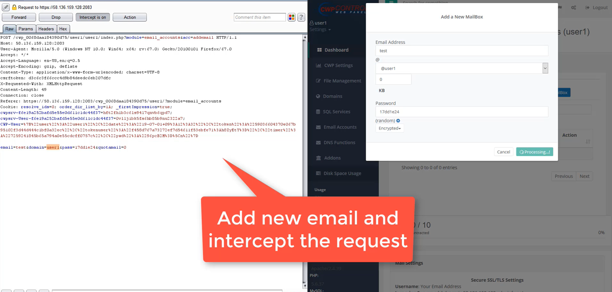</kbd>

<br>

5. Insert payload at parameter "domain" then click "intercept is on" in burp suite

<kbd>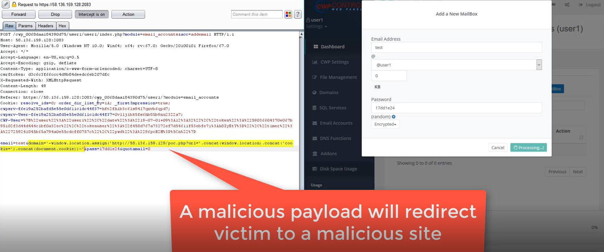</kbd>

<br>

6. Payload added success (in mail box panel user it's doesn't exist after add payload XSS but in panel admin it's will exist)

<kbd>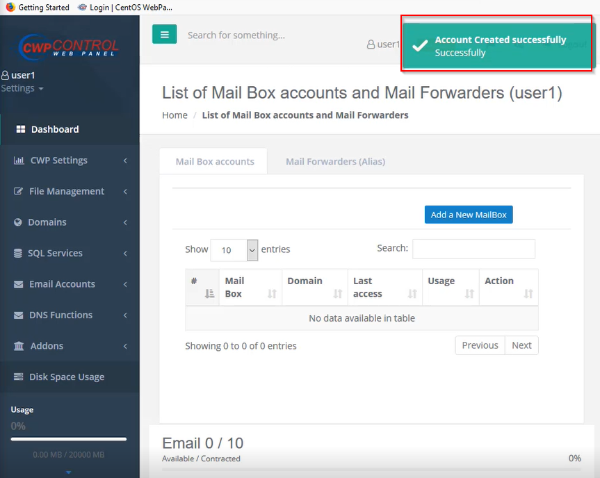</kbd>

<br>

Script change password (PoC.php)

<kbd>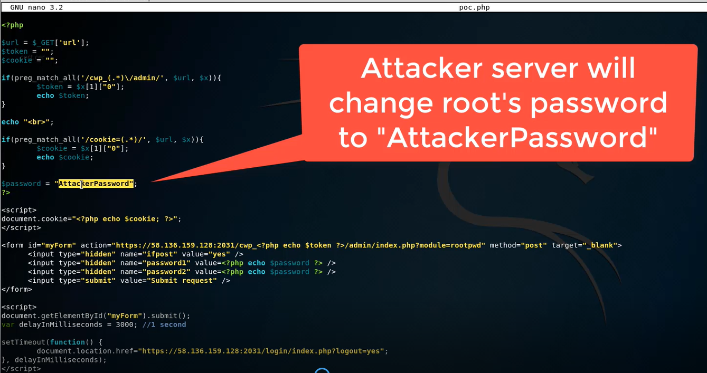</kbd>

<br>

7. Login as user root (victim) 
user : root
pass : P@ssw0rd

<kbd>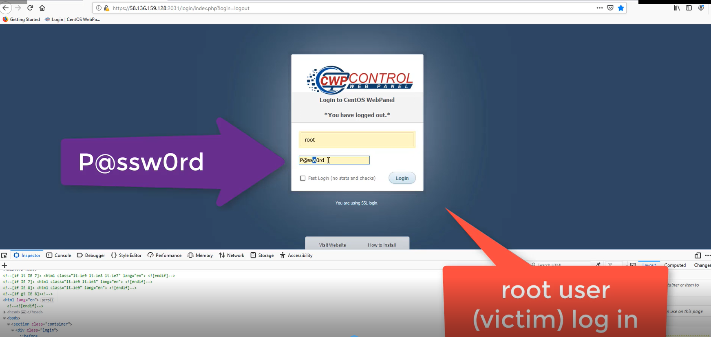</kbd>

<br>

8. After login we will see the left side tap and click at "Email" then click "Email Accounts" under "Email" like image below

<kbd></kbd>

<br>

9. We can see payload 

<kbd>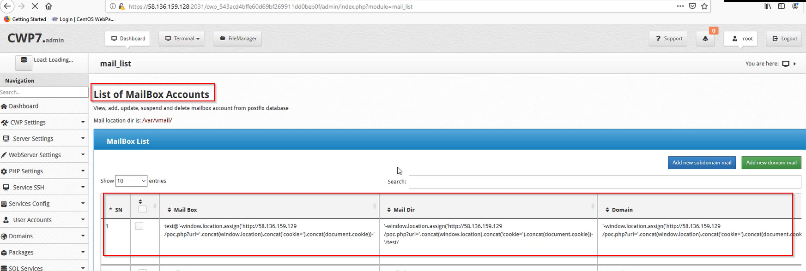</kbd>

<br>

10. Click any button such as Change Password, Suspend, Delete after click Payload will be executed.

<kbd>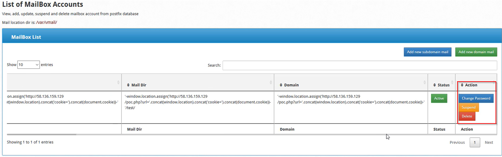</kbd>

<br>

11. After click it's will be redirect and password has been changed password is "AttackerPassword" 

<kbd>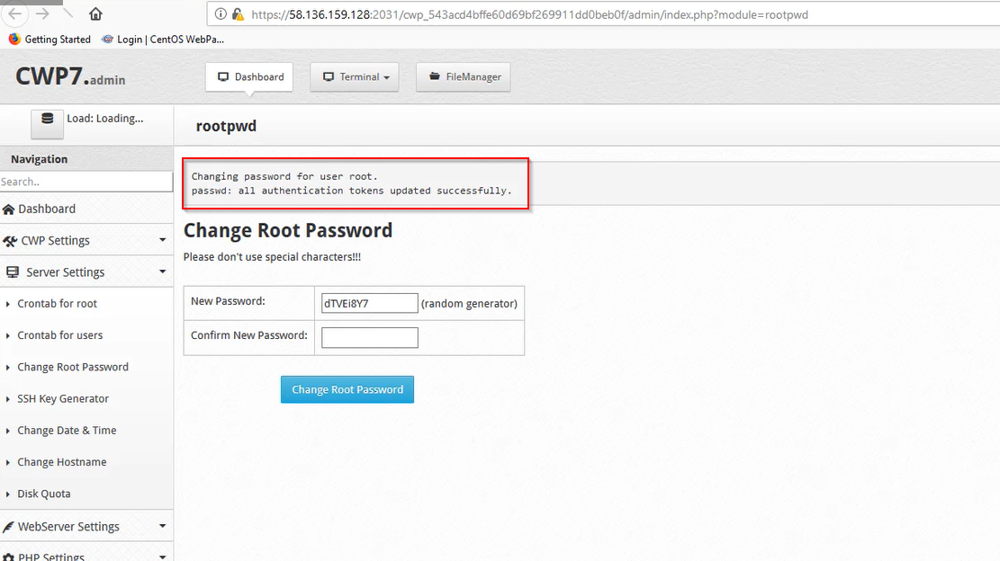</kbd>

<br>

12. try to login with old password "P@ssw0rd" we got login failed (image below)

<kbd>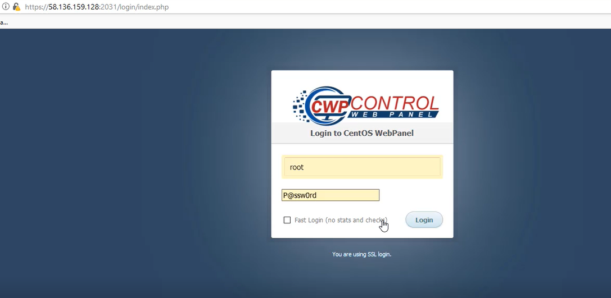</kbd>

<br>

<kbd>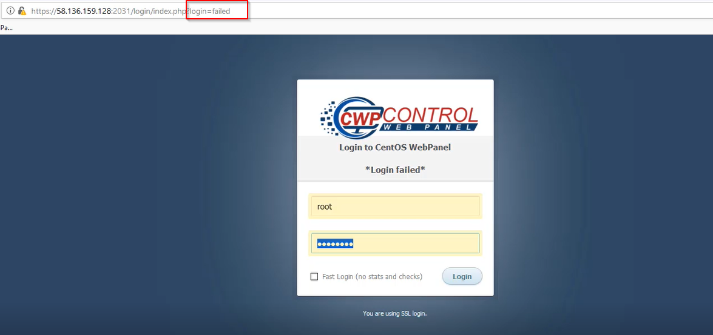</kbd>

<br>

13.  Login as root and new password "AttackerPassword"

<kbd>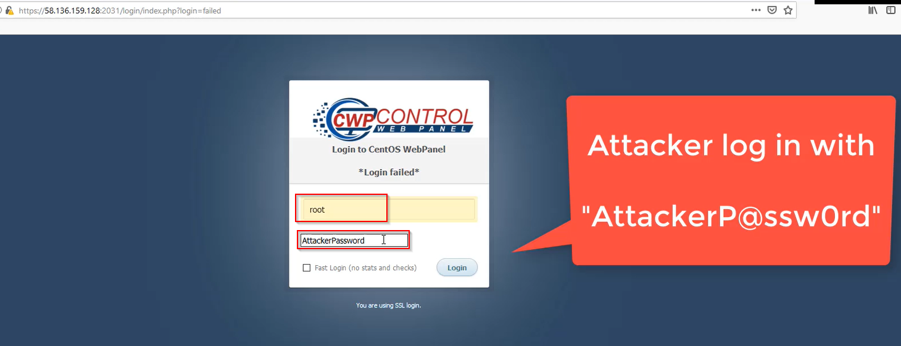</kbd>

<br>

14. Login success

<kdb>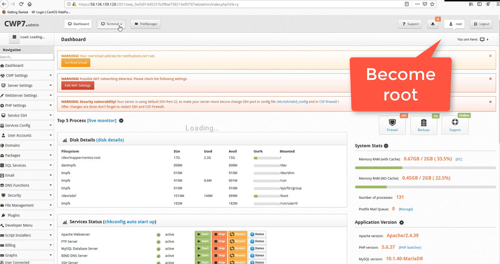</kbd>

<br>

<kbd>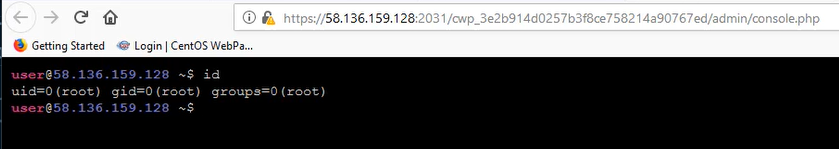</kbd>

# Timeline
```
2019-06-05: Discovered the bug
2019-06-05: Reported to vendor
2019-06-05: Vender accepted the vulnerability
2019-07-17: The vulnerability has been fixed
2019-08-20: Advisory published
```

<br>

# Discovered by
```
Pongtorn Angsuchotmetee
Nissana Sirijirakal 
Narin Boonwasanarak
```
