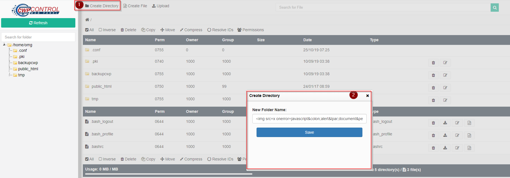
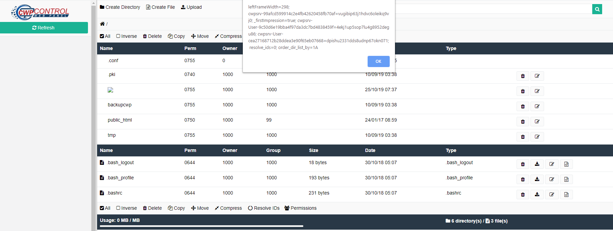
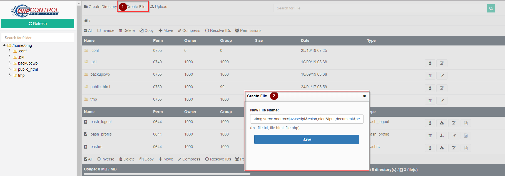

```
Exploit Title       : CWP (CentOS Control Web Panel) Store Cross Site Scripting
Date                : 25 Oct 2019
Exploit Author      : Pongtorn Angsuchotmetee, Nissana Sirijirakal, Narin Boonwasanarak
Vendor Homepage     : https://control-webpanel.com/
Version             : 0.9.8.885
CVE-Number          : CVE-2019-16295
Reference	    : N/A
```
<br>

# Description

User can add XSS payload in Directory Name , Filename , file extension in function "File Manager"

<br>

# Reproduce

1. In user panel go to File Management --> File Manager

<kbd></kbd>

2. Go to "Create Directory" and insert XSS payload "" 

<kbd></kbd>

3. XSS will trigger.

<kbd></kbd>

4. Go to "Create File" and insert XSS payload "" 

<kbd></kbd>

5. XSS will trigger.

<kbd></kbd>

# Timeline
```
2019-07-19: Discovered the bug
2019-07-19: Reported to vendor
2019-07-23: Vender accepted the vulnerability
2019-10-23: The vulnerability has been fixed
2019-10-25: Advisory published
```